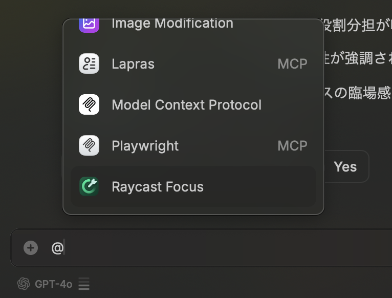
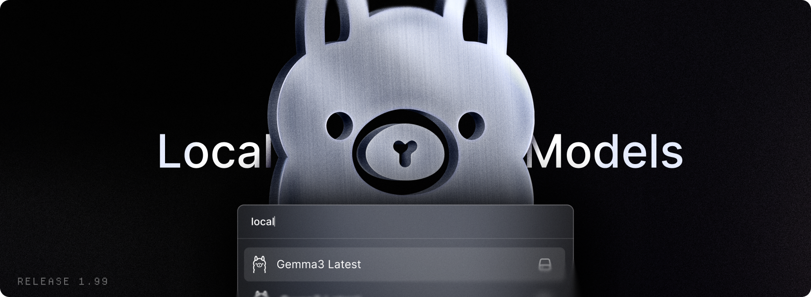

<!-- _class: slide-title -->

  
MCPを利用するインターフェースとしてのRaycastのポテンシャル

2025/06/01 

---

  <h1 class="text-foreground">
    せいじ
    <small class="text-3xl font-bold">(Seiji Nakayama)</small>
  </h1>
  <h5 class="text-dimmed">ただのVimmer</h5>
  

    

      
業務

      <small>バックエンド・Webの開発（たまにアプリ）</small>
    

    

      
言語

      <small>業務 => Go, TypeScript, Kotlin, Flutter  趣味=> Haskell, Rust, Lua</small>
    

    

      
エディタ

      Neovim(intellijも使う)
    

    

      
好き

      
        Vim・ロードバイク・車 
        <strong>シンプルで拡張性があるプロダクト</strong>
      
    

    

      
特徴

      実家が洋菓子店
    

    

      
デバイス

      <small>Apple / EIZO / HHKB Studio</small>
    

    

      
サイト

      <a href="https://sijis.me"><small>HomePage</small></a>
      <a href="https://www.raycast.com/n_seiji"><small>Raycast</small></a>
      <a href="https://github.com/n-seiji"><small>GitHub</small></a>
      <a href="https://x.com/se_eiji">
        X
      </a>
    

  

---

<!-- _class: chapter-divider -->

### Agenda

1. Raycast とは？
2. Raycast MCP
3. Raycast AI Extensions
4. Raycast AI Extensions と Raycast MCP を組み合わせる

5. 終わりに

---

<!-- _class: full lead narration-white -->

# Raycast とは？

---

## Raycast の概要

- macOS 用のランチャーアプリケーション
- キーボードショートカットで素早く操作可能
- 豊富な拡張機能（Extensions）
- plugin の開発も楽

---

## Raycast の主な機能

- アプリケーションの起動
- アプリケーションの特定の機能の起動(★)
- ファイル検索
- クリップボード履歴(★)
- システムコマンドの実行
- カスタムスクリプトの実行(shell, node etc...)(★)
- 拡張機能による機能拡張(★)

★ はデモをお見せします

---

<!-- _class: chapter-divider -->

### Agenda

1. ~~Raycast とは？~~
2. **Raycast MCP**
3. Raycast AI Extensions
4. Raycast AI Extensions と Raycast MCP を組み合わせる

5. 終わりに

---

<!-- _class: full lead narration-white -->

# Raycast MCP

---

## Raycast MCP の設定方法

- Install MCP を起動
- 必要な内容を入力
- Install するだけ

---

## Raycast MCP の使い方

- 好きな方法で起動
  - alias
  - ショートカット
  - AI Extensions

---

<!-- _class: chapter-divider -->

### Agenda

1. ~~Raycast とは？~~
2. ~~Raycast MCP~~
3. **Raycast AI Extensions**
4. Raycast AI Extensions と Raycast MCP を組み合わせる

5. 終わりに

---

<!-- _class: full lead narration-white -->

# Raycast AI Extensions

---

## Raycast AI Extensions の機能

- @メンションを使って使える機能
  - Raycast 内なら色々なところで使える

---

<!-- _class: chapter-divider -->

### Agenda

1. ~~Raycast とは？~~
2. ~~Raycast MCP~~
3. ~~Raycast AI Extensions~~
4. **Raycast AI Extensions と Raycast MCP を組み合わせる**

5. 終わりに

---

<!-- _class: full lead narration-white -->

# Raycast AI Extensions と Raycast MCP を組み合わせる

---

## YouTube 動画の要約機能

- URL から動画情報の取得
- youtube の動画をダウンロード
- AI で要約

---

## その他の組み合わせ例

- 開いてる web ページの情報を取得し、要約、サイトについて AI に聞く
- playwright で立ち上げ、操作した先の web ページをクロールしてデータを整形する
- 調べたい情報が入った csv を入力に Firecrawl に渡し、結果をまとめて出力する

---

<!-- _class: chapter-divider -->

### Agenda

1. ~~Raycast とは？~~
2. ~~Raycast MCP~~
3. ~~Raycast AI Extensions~~
4. ~~Raycast AI Extensions と Raycast MCP を組み合わせる~~
5. **終わりに**

---

# Raycast の可能性

- 普通なら：コードを書く必要がある
- Raycast：すぐに形にできる、ほとんど自然言語

MCP と AI Extension は local で llm を動かせば全部無料で使える

---

## 参考リンク

- [Raycast 公式サイト](https://www.raycast.com)
- [Raycast API ドキュメント](https://developers.raycast.com)
- [Raycast GitHub](https://github.com/raycast/extensions)
- [Raycast コミュニティ](https://raycast.com/community)
