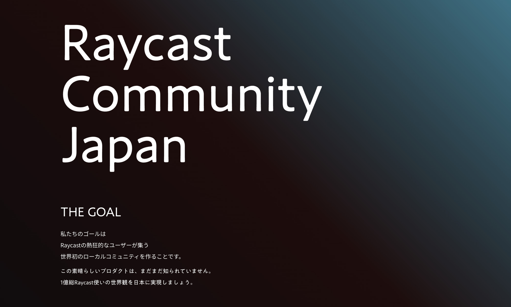
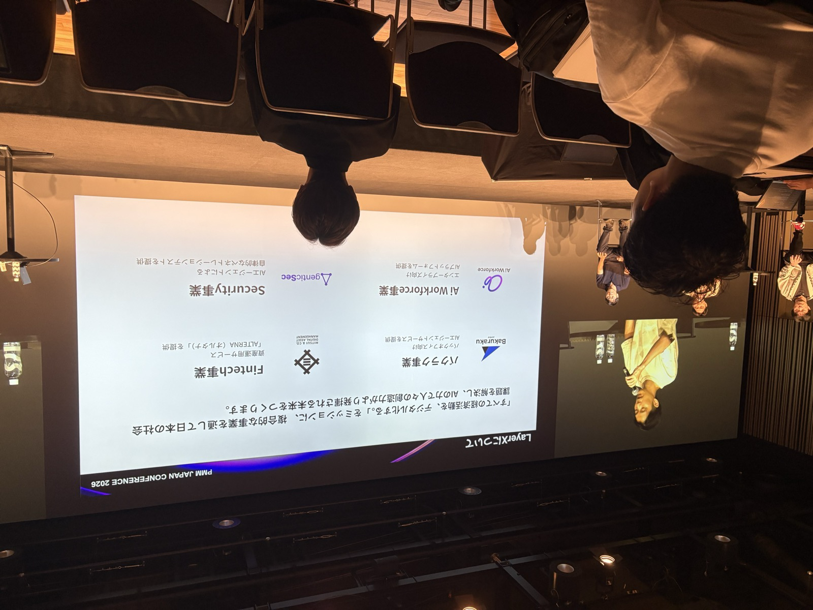

<!-- _class: slide-title -->

  
Fintech ｺﾜｸﾅｲﾖ

Seiji Nakayama

2026/07/13 Welcome Fintech #6 夏の大トーク大会

---

  <h1 class="text-foreground">
    せいじ
    <small class="text-3xl font-bold">(Seiji Nakayama)</small>
  </h1>
  <h5 class="text-dimmed">x (@se_eiji)</h5>
  

    

      
所属

      株式会社miive
    

    

      
会社の特徴

      金曜日は「よい週末を！」って言う
    

    

      
業界歴

      <strong>7ヶ月</strong>
    

    

      
業務

      <small>バックエンド・Web・アプリ開発</small>
    

    

      
性格

      好奇心旺盛
    

    

      
苦手なもの

      おばけ
    

    

      
好き

      Raycast・Vim・ロードバイク
    

    

      
サイト

      <a href="https://sijis.me"><small>HomePage</small></a>
      <a href="https://www.raycast.com/n_seiji"><small>Raycast</small></a>
      <a href="https://github.com/n-seiji"><small>GitHub</small></a>
      <a href="https://x.com/se_eiji">
        X
      </a>
    

  

---

## 経歴(色々やってる)

2025/11 より前は、ナビゲーションの会社にいました。

- 物流系のサービス開発
- サッカーに関する新規事業の 0→1 開発
- 地図の配信システム開発
- SRE
- 一瞬 POS システムの開発にも

詳しくは => [sijis.me](https://sijis.me)

---

## イベントとかも好き

**[Raycast Community Japan](https://devx.jp/rct)** の運営もしてたりしてます。

  

---

## 余談: 今日も日中、別のイベントに参加してました

  

**PMM JAPAN CONFERENCE 2026**

守屋さんのお話、めっちゃ面白かったです。

<u>**LayerXのどなたか。 守屋さんをご紹介いただきたいです mm**</u>

---

## 遡ること2年前、#welcome_fintech に参加

  

---

## 当時の Fintech のイメージ

- COBOL とか使ってるんでしょ？
- セキュリティめっちゃ厳しくて <u>**Raycast 使えなそう**</u>
- 強強エンジニアが集まっている場所
- **一見さんお断り**
- むずい。複雑。

---

<!-- _class: full lead narration-white -->

イベントを通して

# 「もしかしたら、こわくないかも」

ってなった

---

<!-- _class: full lead narration-white -->

###### 今日話すこと

# 実際に入ってみて Fintechって怖くなかった

---

<!-- _class: full lead narration-white -->

改めて、miive の中山です。

---

## miive は福利厚生カードを作っています

- **BtoBtoC** のサービス
- 管理者(企業側)が制度をつくる
- 従業員はアプリで確認 & <u>**カードで支払う**</u>ことで福利厚生を使える

簡単にいうと<strong>「今の福利厚生、使いづらいから使いやすくしようぜ！」</strong>というサービス。

  

---

## ポイントとマネー

会社から付与される<strong>「ポイント」</strong>と、ユーザー自身がチャージする<strong>「マネー」</strong>がある。

ポイントが使えるお店で「ピッ」ってすると、

例えば、<u>**半分はポイントから、半分はマネーから引かれる**</u>。

  
  
→

  

---

## 入社してからやってたこと(私の場合)

- **web やアプリが中心のサービス開発**
- **顧客からの問い合わせ対応** 
 → <u>**少しずつ決済に触れる**</u>。

決済をしっかり触ったのは、**ここ2ヶ月ぐらい**。

---

<!-- _class: full lead narration-white -->

# 決済、めっちゃたのしい

---

## 楽しいポイント 0: 前提、意味がわからない概念が登場する

| 概念             | ざっくり言うと                                             |
| ---------------- | ---------------------------------------------------------- |
| オーソリ         | 店舗で支払った瞬間に飛んでくる「利用予定」の通知(与信枠の確保) |
| クリアリング     | 後日届く「売上確定」の情報。ここで金額が変わることも       |
| リコンサイル     | 記録同士を突き合わせて、ズレがないか確認する作業           |
| イシュア         | カードを発行する側。miive はここ                           |
| アクワイアラ     | 加盟店(お店)を管理する側                                   |
| チャージバック   | 不正利用などで、決済を取り消してお金を取り返す仕組み       |

---

## 楽しいポイント 1: 思ったよりもゆるい

決済は、Visa のネットワークから送られてくる情報を元に処理する。

で、その<u>**送られてくるデータが案外適当**</u>。

- 決済日が正確でない
- 返金なのに<u>**元の取引が特定できない**</u>

それを受け止める設計を考えるのが**面白い**(辛いけど)。

---

## 楽しいポイント 2: 日々発見しかない

知らない仕様がたくさん出てきて**おもろい**。発見がある。

<u>**「普段の支払いの裏でこんなことおきてたのか〜」と思いを馳せる。**</u>

Visa の他にも ISMS や PCI DSS など、色々な基準がある。**むずい & おもろい**。

---

## 楽しいポイント 3: 縛りがある中での実装

顧客の要望や実現したい機能と、サービスの制約。

どう<u>**落としどころ**</u>をつけるか？

---

## ここ2ヶ月、自分はこんなことやってた

- 曜日や時間帯で**決済を制限**
  - 会社が意図した時間外での決済では、ポイントが使えなくなる
- **ポイント利用上限**を設定
  - 一回の決済で使えるポイントの上限金額を制限する(一気にポイントを使い切らないように)

簡単に見えるが、<u>**落とし穴だらけ**</u>。

---

## 「曜日や時間帯で決済を制限」機能の場合

実装前:「オーソリが来た時の情報で判断すればいいんでしょ？**秒じゃん。**」

↓ 実際

- オーソリだけじゃない、<u>**クリアリングでも判断が必要**</u>。

- **決済した日時が入ってない**クリアリングもある！？

- **追加徴収** & 元取引が見つからない場合、どうする？

- オーソリ、クリアリングの場合の仕様を、顧客・ビジネスサイドに**どう説明する**？

---

## ＋自社サービスならではの複雑さ

お店で**決済をするタイミング**と、決済を経て制度の利用申請を出して**補助が確定するタイミング**がある。

それぞれで<u>**残高や残ポイントの変動**</u>が発生。

**2倍ややこしい。**

---

## 当時のイメージ、答え合わせ

| 当時のイメージ                 | 7ヶ月経った現実                          |
| ------------------------------ | ---------------------------------------- |
| COBOL とか使ってるんでしょ？   | **1行も書いてません**                    |
| Raycast 使えなそう             | **バリバリ使えてます**                   |
| 強強エンジニアの集まり         | 強い人はいる。でも**みんなやさしい**     |
| 一見さんお断り                 | むしろ **Welcome** でした(このイベント名) |
| むずい。複雑。                 | ほんとにむずい。でも、**たのしい**       |

---

<!-- _class: full lead narration-white -->

決済、やっぱり怖いかもしれない、、、むずい。。。

###### お金なにかあったら怖い。。。

---

<!-- _class: full lead narration-white -->

ただ、俯瞰してみると...

---

<!-- _class: full lead narration-white -->

# やってること、あんま変わらない

---

## 極論、通常のサービス開発

**顧客にいいものを届ける。ユーザーが使いやすいようにする。**

  
考える<small>課題深堀り 要望・制約の落としどころ</small>

  
→

  
作る<small>設計・実装</small>

  
→

  
デリバリーする<small>ユーザーに届ける</small>

※ なにかあったときの責任は重い(お金なので)。

---

## シミュラクラ現象

点が3つ集まると、人は勝手に<strong>「顔」</strong>として認識してしまう。

  

    

  

  
=

  
😱

正体を知らないものを、人は<u>**勝手に怖いものとして見てしまう**</u>。

---

<!-- _class: full lead narration-white -->

# 知ると、Fintech ｺﾜｸﾅｲﾖ

---

<!-- _class: slide-last -->

# welcome_fintech

ご清聴ありがとうございました

みなさん、よい夏を！👻
