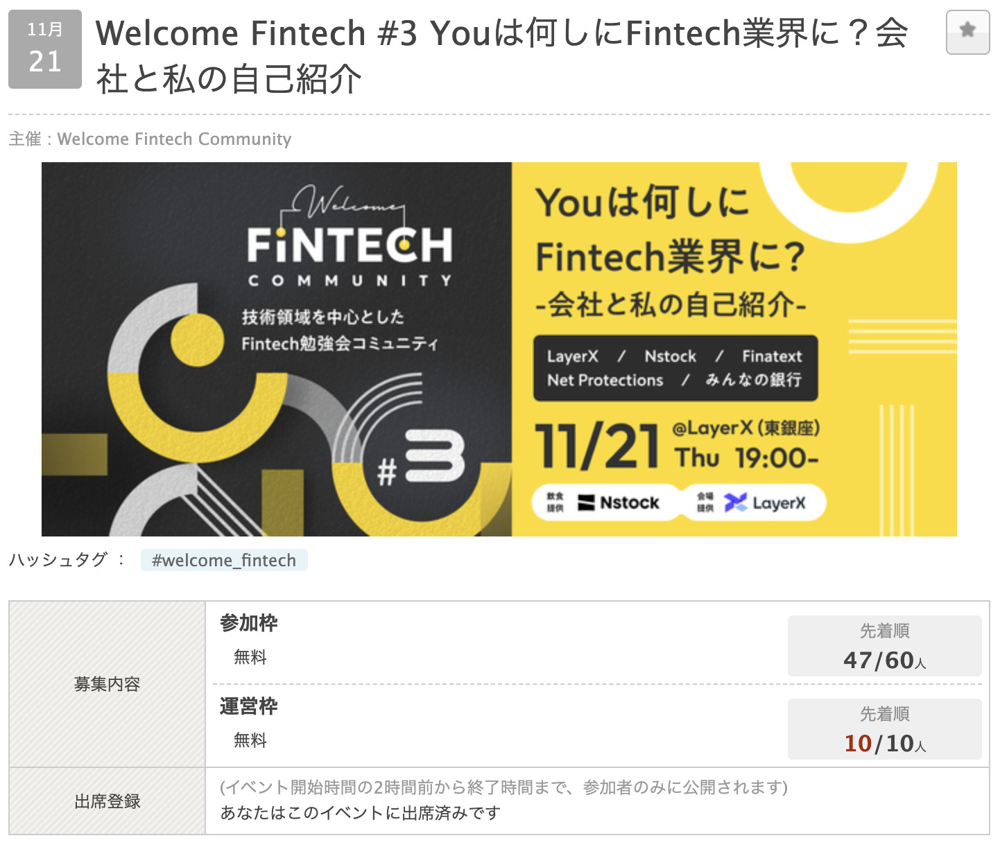
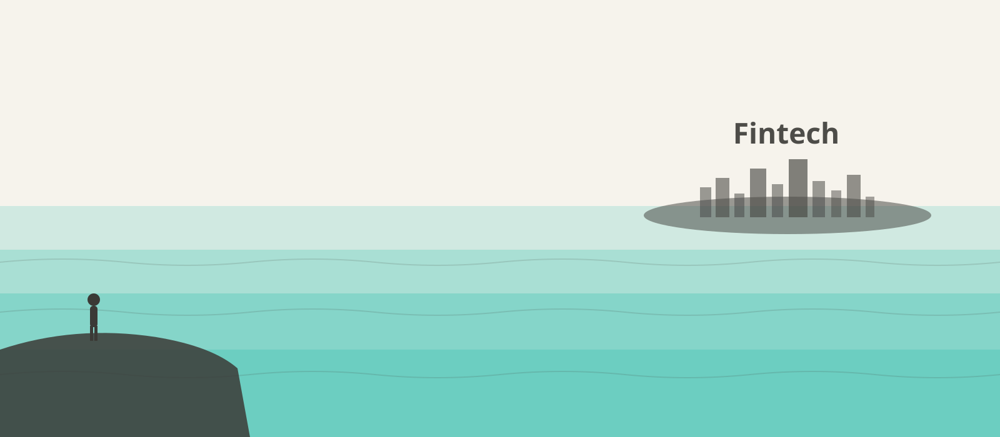
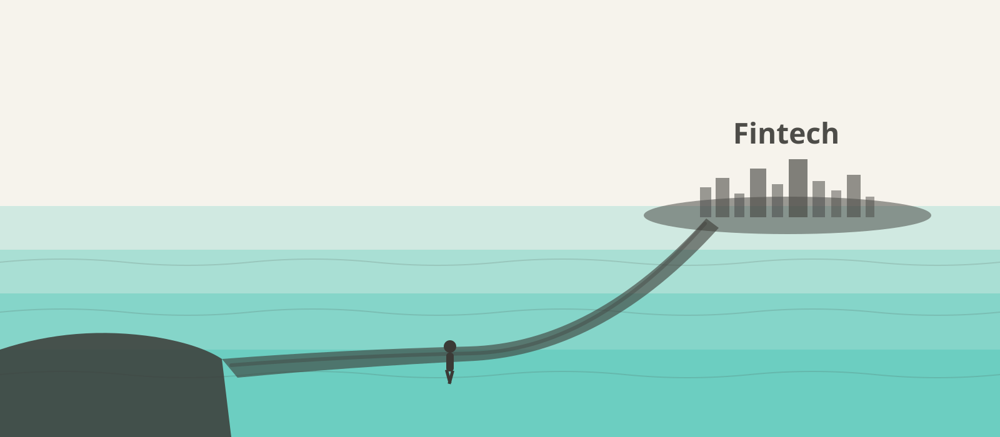

<!-- _class: slide-title -->

  
Fintechは地続きだった

Seiji Nakayama

2026/07/13 Welcome Fintech #6 夏の大トーク大会

---

<!-- _class: full lead narration-white -->

# Welcome Fintech #6

# 夏の大トーク大会ーーー！！！

<!-- タイトルコール。全力で読み上げる -->

---

<!-- _class: full lead narration-white -->

皆さん、夏ですね！

---

<!-- _class: full lead narration-white -->

夏といえば、、、？

---

<!-- _class: full lead narration-white -->

# 海！

---

<!-- _class: full lead narration-white -->

# 海といえば、青！

---

<!-- _class: full lead -->

# 青といえば、miive！

---

## miive！

  

---

  <h1 class="text-foreground">
    せいじ
    <small class="text-3xl font-bold">(Seiji Nakayama)</small>
  </h1>
  <h5 class="text-dimmed">x (@se_eiji)</h5>
  

    

      
所属

      株式会社miive
    

    

      
業界歴

      フィンテック <strong>7ヶ月</strong>
    

    

      
業務

      <small>バックエンド・Web・アプリ開発</small>
    

    

      
好き

      
        Raycast・Vim・ロードバイク 
        <strong>シンプルで拡張性があるプロダクト</strong>
      
    

    

      
特徴

      実家が洋菓子店
    

    

      
会社の特徴

      金曜日は「よい週末を！」って言う
    

    

      
サイト

      <a href="https://sijis.me"><small>HomePage</small></a>
      <a href="https://www.raycast.com/n_seiji"><small>Raycast</small></a>
      <a href="https://github.com/n-seiji"><small>GitHub</small></a>
      <a href="https://x.com/se_eiji">
        X
      </a>
    

  

---

## 経歴

2025/11 より前は、ナビゲーションの会社にいました。

- 物流系のサービス開発
- 新規事業の 0→1 開発
- 地図の配信システム開発、SRE
- 一瞬 POS システムの開発にも

詳しくは => [sijis.me](https://sijis.me)

---

<!-- _class: full lead narration-white -->

<!-- 改めてのタイトルコール -->

# 「Fintechは地続きだった」

---

## 遡ること2年前、#welcome_fintech に参加

  

---

## 当時の Fintech のイメージ

- COBOL とか使ってるんでしょ？
- セキュリティめっちゃ厳しくて <u>**Raycast 使えなそう**</u>
- 強強エンジニアが集まっている場所
- **一見さんお断り**
- むずい。複雑。

---

<!-- _class: full lead narration-white -->

# 要するに、海の向こうの世界

###### (夏だけに)

---

## そこから

転職を考え始め、SmartBank さんのカジュアル面談などもお願いした。

からの、色々あって今の会社 **miive** に。

---

## miive は福利厚生カードを作っています

- **BtoBtoC** のサービス
- 管理者(企業側)が制度をつくる
- 従業員はアプリで確認 & <u>**カードで支払う**</u>ことで福利厚生を使える

---

## ex. ピってやったら半額、会社から補助がでる

  
  
→

  

---

## 入社してからやってたこと

1〜5ヶ月目は、**サービス開発**、**問い合わせの調査**。

<!-- TODO: ギュッと略歴を載せる(オンボ→管理者画面→チーム再編 など1行ずつ) -->

ここ2ヶ月で、<u>**決済に関わる部分**</u>にも手を入れ始めた。

---

<!-- _class: full lead narration-white -->

# 決済、めっちゃたのしい

---

## 楽しいポイント 1: 思ったよりもゆるい

決済は、Visa のネットワークから送られてくる情報を元に処理する。

で、その<u>**送られてくるデータが案外適当**</u>。

- 決済日が正確でない
- 返金なのに<u>**元の取引が特定できない**</u>

それを受け止める設計を考えるのが**面白い**(辛いけど)。

---

## 楽しいポイント 2: 日々発見しかない

知らない仕様がたくさん出てきて**おもろい**。発見がある。

<u>**「普段の支払いの裏でこんなことおきてたのか〜」と思いを馳せる。**</u>

Visa の他にも ISMS や PCI DSS など、色々な基準がある。**むずい & おもろい**。

---

## 楽しいポイント 3: 縛りがある中での実装

顧客の要望や実現したい機能と、サービスの制約。

どう<u>**落としどころ**</u>をつけるか？

---

## 自分はこんなことをやってた

- 曜日や時間帯で**決済を制限**
- **上限金額**を設定

簡単に見えるが、<u>**落とし穴だらけ**</u>。

---

## 実装前の認識

- オーソリ(店舗で支払った瞬間に飛んでくる、利用予定の通知)が来た時の情報で判断すればいいんでしょ？**秒じゃん。**

↓ 実際

- オーソリだけじゃない、<u>**クリアリングでも判断が必要**</u>
- クリアリング時には**決済した日時が入ってない場合もある**！？
- **追加徴収**のクリアリングが来た場合 & 元取引が見つからなかったらどうする？
- 顧客 & ビジネスサイドに**どう説明する**？

---

## ＋自社サービスならではの複雑さ

お店で**決済をするタイミング**と、決済を経て制度の利用申請を出して**補助が確定するタイミング**がある。

それぞれで<u>**残高や残ポイントの変動**</u>が発生。

**2倍ややこしい。**

---

## 当時のイメージ、答え合わせ

| 当時のイメージ                 | 7ヶ月経った現実                          |
| ------------------------------ | ---------------------------------------- |
| COBOL とか使ってるんでしょ？   | **1行も書いてません**                    |
| Raycast 使えなそう             | **バリバリ使えてます**                   |
| 強強エンジニアの集まり         | 強い人はいる。でも**みんなやさしい**     |
| 一見さんお断り                 | むしろ **Welcome** でした(このイベント名) |
| むずい。複雑。                 | ほんとにむずい。でも、**たのしい**       |

---

<!-- _class: full lead narration-white -->

ただ、俯瞰してみると、、、

---

<!-- _class: full lead narration-white -->

# やってること、あんま変わらない

---

## 本当にやってることはおんなじ

**顧客にいいものを届ける。ユーザーが使いやすいようにする。**

  
考える<small>要望・制約の落としどころ</small>

  
→

  
作る<small>設計・実装</small>

  
→

  
デリバリーする<small>ユーザーに届ける</small>

※ なにかあったときの責任は重い(お金なので)。

---

<!-- _class: full lead narration-white -->

海の向こうだと思ってた Fintech、、、

  

---

<!-- _class: full lead narration-white -->

# そう、Fintechは地続きだった

  

###### 泳がなくても、歩いて来られました

---

<!-- _class: slide-last -->

# welcome_fintech

ご清聴ありがとうございました

みなさん、よい夏を！🌊
