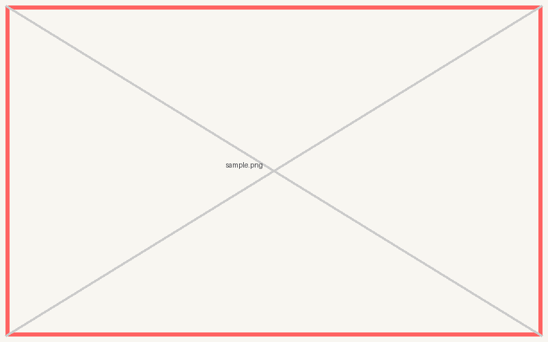

<script src="https://cdn.tailwindcss.com/3.4.4"></script>
<script>tailwind.config = { corePlugins: { preflight: false } }</script>

<style>
:root {
  --color-primary: #ff6362;
}
</style>

<!-- _class: slide-title -->
<!-- 1. 表紙 -->

<div class="title">
  <div>発表タイトル</div>
</div>
<div class="name">Seiji Nakayama</div>
<div class="date-and-event">2026/07/04 イベント名</div>

---

<!-- 2. 自己紹介 -->


<div>
  <h1 class="text-foreground">
    せいじ
    <small class="text-3xl font-bold">(Seiji Nakayama)</small>
  </h1>
  <h5 class="text-dimmed">x (@se_eiji)</h5>
  <div class="mt-12 space-y-2 text-2xl">
    <div class="item">
      <div class="label">業務</div>
      <span><small>バックエンド・Webの開発(たまにアプリ)</small></span>
    </div>
    <div class="item">
      <div class="label">エディタ</div>
      <span>Neovim(intellijも使う)</span>
    </div>
    <div class="item">
      <div class="label">好き</div>
      <span>Raycast・Vim・ロードバイク・車</span>
    </div>
  </div>
</div>

---

<!-- _class: chapter-divider -->
<!-- 3. 章区切り(アジェンダ): strong = いま話す章 / 打ち消し = 話し終えた章 -->

<div class="left">
  <h2>アジェンダ</h2>
</div>
<div class="right">

1. **いま話す章**
2. 次の章
3. ~~話し終えた章~~

</div>

---

<!-- _class: lead -->
<!-- 4. 1 メッセージ(リード): 言いたいことを 1 つだけ大きく -->

## 伝えたいことを *1 つだけ* 大きく書く

---

<!-- 5. 箇条書き(3 点) -->

## 箇条書きのスライド

- ポイントは 3 つまでに絞る
- *強調したい語* は em(アスタリスク 1 つ)で secondary 色になる
- `inline code` も使える
  - ネストも可能

---

<!-- 6. 番号付きステップ -->

## 手順・ステップ

1. 番号付きリストは丸数字で表示される
2. 手順や時系列の説明に使う
3. 各項目は 1 行に収める

---

<!-- 7. 画像 1 枚 + キャプション -->

## 画像 1 枚 + キャプション



<div class="note" style="text-align: center;">※ 図の補足やソースをキャプションとして添える</div>

---

<!-- _class: full lead narration-white -->
<!-- 8. 全面画像 + ナレーション -->


画像の上に重ねる白文字のナレーション

---

<!-- 9. 左画像 + 右テキスト -->


## 左画像 + 右テキスト

- `` で画像を左 40% に配置
- 右側は通常の Markdown
- 比率は `left:30%` などで調整

---

<!-- _class: grid-5-5 -->
<!-- 10. 2 カラム比較 -->

## 2 カラム比較

<div class="left">

### Before

- 従来のやり方
- 課題があった

</div>
<div class="right">

### After

- 新しいやり方
- *こう良くなった*

</div>

---

<!-- 11. 表による比較 -->

## 表による比較

|              | 案 A       | 案 B       |
| ------------ | ---------- | ---------- |
| コスト       | 低い       | 高い       |
| 拡張性       | 低い       | *高い*     |
| 導入の手間   | ほぼなし   | 中くらい   |

---

<!-- 12. 引用 -->

## 引用

> シンプルさは究極の洗練である。
> [Wikipedia](https://ja.wikipedia.org/wiki/レオナルド・ダ・ヴィンチ)

---

<!-- 13. コード + 説明 -->

## コード + 説明

<div class="grid-col-5-5">
<div>

```sh
make new NAME=my-talk
make html DECK=my-talk
```

</div>
<div>

- 左にコード、右に説明
- `grid-col-5-5` で半々に分割
- 比率は `grid-col-4-6` 等で調整

</div>
</div>

---

<!-- _class: slide-last -->
<!-- 14. 最終スライド -->

# ご清聴ありがとうございました
