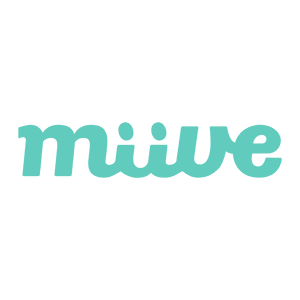
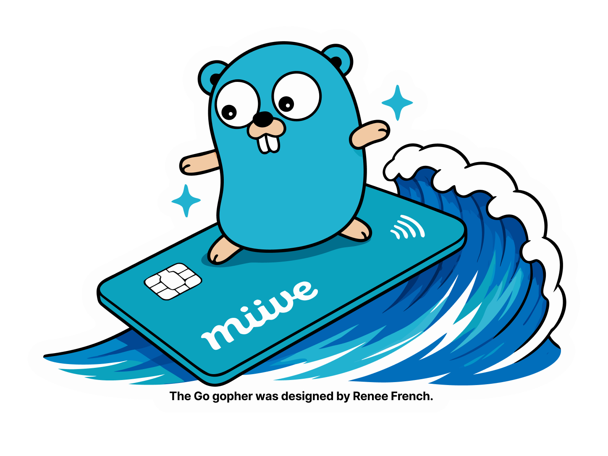

<script src="https://cdn.tailwindcss.com/3.4.4"></script>
<script>tailwind.config = { corePlugins: { preflight: false } }</script>

<style>
:root {
  --color-primary: #007d9c;
  --color-secondary: #b5482e;
  /* 白(羊皮紙)背景バリアント(戻すときはこの5行と narration-white の上書きを消す) */
  --color-foreground: #33302a;
  --color-background: #f6f2e8;
  --color-dimmed: #7a7466;
  --color-dimmed-background: #fffdf7;
  --color-ghost: #b4ac99;
}
section.narration-white > p {
  color: #33302a;
}
</style>

<!-- _class: slide-title -->

<div class="title">
  <div>AIに新しいGoを書かせる</div>
</div>
<div class="name">Seiji Nakayama</div>
<div class="date-and-event">2026/08/27 Go Connect #16</div>

---


<style scoped>
.item {
  display: flex;
  align-items: center;
  gap: 0.75em;
}
</style>

<div>
  <h1 class="text-foreground">
    せいじ
    <small class="text-3xl font-bold">(Seiji Nakayama)</small>
  </h1>
  <h5 class="text-dimmed">x (@se_eiji)</h5>
  <div class="mt-12 space-y-2 text-2xl">
    <div class="item">
      <div class="label">所属</div>
      <span>株式会社miive</span>
    </div>
    <div class="item">
      <div class="label">業務</div>
      <span><small>バックエンド(Go)・Web・アプリ開発</small></span>
    </div>
    <div class="item">
      <div class="label">エディタ</div>
      <span>Neovim</span>
    </div>
    <div class="item">
      <div class="label">好き</div>
      <span>Raycast・Vim・ロードバイク</span>
    </div>
    <div class="item">
      <div class="label">サイト</div>
      <a href="https://sijis.me"><small>HomePage</small></a>
      <a href="https://www.raycast.com/n_seiji"><small>Raycast</small></a>
      <a href="https://github.com/n-seiji"><small>GitHub</small></a>
      <a href="https://x.com/se_eiji">X</a>
    </div>
  </div>
</div>

---

## miiveではGoを利用しています！

従業員向けの**プリペイドカード型 福利厚生プラットフォーム**

- 会社が従業員に福利厚生を配る
- ランチ代・書籍代などに使える
- **お金が動くサービス**

### 決済だからこそ、*軽量 & 型安全*な Go


---

## 余談：miive と Go、カラーが近い

<style scoped>
.brand-colors {
  display: grid;
  grid-template-columns: 4fr 6fr;
  gap: 3rem;
  align-items: center;
}
.miive-brand {
  text-align: center;
}
.miive-brand img {
  display: block;
  width: 330px;
  margin: -3rem auto -2rem;
}
.go-palette {
  display: grid;
  gap: 0.8rem;
}
.go-color {
  padding: 0.7rem 1rem;
  color: #fff;
  font-weight: 700;
  border-radius: 0.25rem;
}
.gopher-blue { background: #00add8; }
.light-blue { background: #5dc9e2; color: #33302a; }
.aqua { background: #00a29c; }
</style>

<div class="brand-colors">
<div class="miive-brand">
  
  <strong>miive</strong>
</div>
<div>

### Go 公式カラーパレット

<div class="go-palette">
  <div class="go-color gopher-blue">GOPHER BLUE　#00ADD8</div>
  <div class="go-color light-blue">LIGHT BLUE　#5DC9E2</div>
  <div class="go-color aqua">AQUA　#00A29C</div>
</div>

</div>
</div>

### Light Blue〜Aquaあたり、近い気がしている

<div class="note">出典: <a href="https://go.dev/s/brandbook">Go Brand Book</a></div>

---

<!-- _class: full lead narration-white -->


<style scoped>
h1 {
  color: #6b4420;
  text-shadow: 0 2px 18px rgba(246, 242, 232, 0.9);
  letter-spacing: 0.04em;
}
h1 strong { color: #b5482e; }
.note {
  text-align: center;
  margin-top: 2rem;
  color: #8a7c62;
}
</style>

# 世はまさに<br />**大AI時代**！

<div class="note">miiveでも Claude Code / Codex / OpenCode / Raycast / Devin …</div>

---

<!-- _class: lead -->

## AI は「学習したもの」

## <span class="text-primary">書き方が、学習データの時点で止まっている</span>

---

## Go は半年に1回変わる

| バージョン | リリース |
|---|---|
| 1.25 | 2025年8月 |
| 1.26 | 2026年2月 |
| **1.27** | **2026年8月** |

半年ごとに、書き方も標準ライブラリも少しずつ新しくなる

---

## 具体的にはこういうコードが出てくる

```go
var s interface{}                            // → any
for i := 0; i < n; i++ {}                    // → for i := range n
sort.Slice(xs, func(i, j int) bool { return xs[i] < xs[j] }) // → slices.Sort
atomic.AddInt64(&counter, 1)                 // → counter.Add(1)
wg.Add(1); go func() { defer wg.Done() }()   // → wg.Go(...)
```

*動くけど、古い*

- テストも通る。レビューで「それ `any` で」と言うしかない
- しかも Go は半年ごとに変わるので、**指摘するネタは増え続ける**

---

<!-- _class: lead -->

## 人が指摘するのをやめて

## 新しい書き方に**自動で寄せる**

# `go fix`

---

## `go fix` は Go 1.26 で別物になった

> The venerable `go fix` command has been **completely revamped**
> and is now the **home of Go's _modernizers_**.
>
> The `go fix` command's historical fixers, all of which were obsolete,
> **have been removed**.
> [Go 1.26 Release Notes](https://go.dev/doc/go1.26)

<div class="note">
由緒ある go fix コマンドは<strong>全面的に作り直され</strong>、いまや Go の
<strong>モダナイザの本拠地</strong>になった。<br />
古い fixer は、すべて時代遅れになっていたので<strong>削除された</strong>。
</div>

---

## modernize は「スタイル」だけの話ではない

`atomictypes`

```go
// Before
var counter int64
atomic.AddInt64(&counter, 1)

// After
var counter atomic.Int64
counter.Add(1)
```

- **非アトミックなアクセスが型で不可能になる**
- 32bit 環境のアライメントバグも黙って消える

---

## `go vet` はチェック、`go fix` は更新

同じ **analysis framework** を使うが、*役割と標準動作*が違う

| | 役割 | 標準では |
|---|---|---|
| `go vet` | バグになりそうなコードを探す | **報告する** |
| `go fix` | 今風に直せるコードを探す | **書き換える** |

<div class="note">go vet も -fix を付ければ、直せるものは書き換えられる</div>

### `go fix` は、コードを**今の Go らしい書き方へ更新する**入口

---

## Go 1.27 で fixer の顔ぶれが変わった

Go の文法が変わったのではなく、**`go fix` が直せる範囲**が変わった

<div class="grid-col-5-5">
<div>

**追加**

- `atomictypes`
- `slicesbackward`
- `embedlit`
- `unsafefuncs`

<div class="note">embedlit だけは 1.27 の言語変更<br />(構造体リテラルのキー拡張) への追随</div>

</div>
<div>

**削除**

- `fmtappendf`

**改名**

- `waitgroup` → `waitgroupgo`

<div class="note">go vet 側の同名 analyzer と<br />紛らわしいため</div>

</div>
</div>

---

<!-- _class: lead -->

# ここからが本題

---

<!-- _class: lead -->

## AI は**既存コードを真似る**

## ↓

## コードベースを新しく保てば

## <span class="text-primary">AI の出力も新しくなる</span>

---

## `go fix` は掃除ではなく、AI への継続的な教育

<div class="grid-col-5-5">
<div>

**これまでの効能**

コードが新しくなる

</div>
<div>

**AI 時代の効能**

*AI の書き方が新しくなる*

</div>
</div>

- 周りが `interface{}` だらけなら、AI も `interface{}` で書く
- 周りが `any` なら、AI も `any` で書く
- **コードベースが、AI にとってのお手本になっている**

---

## 運用はシンプル

```bash
go fix ./...        # 直す
go fix -diff ./...  # 直さずに差分だけ出す(CI 用)
```

- push / PR の前に回してコミットするだけ
- **Claude Code だろうが Codex だろうが OpenCode だろうが同じ**
  - ツールごとに設定を書き分けなくていい
- miive では push 直前のフックで強制している

---

<!-- _class: lead -->

## これで、**モダンな書き方**になる

### AI が書いても、コードベースは古くならない

---

## 蛇足：AI がもたらした副作用が、もう 2 つ

<div class="grid-col-5-5">
<div>

**① 自分のコードを信用する**

動かしていないのに
「動きます！」と言う

</div>
<div>

**② テストが肥大化する**

昔: カバレッジをどう上げるか

今: *誰でも簡単に書けるので、
増えすぎる*

</div>
</div>

---

## AI 時代のチェックを、速く回す

<div class="grid-col-5-5">
<div>

### ① 正しさを担保する

- **CI で落とす**
- **AI でレビュー**（Devin など）

</div>
<div>

### ② 待ち時間を減らす

- テストそのものを高速化
- **Blacksmith** で CI 基盤も高速化

</div>
</div>

**チェックを増やしても、開発を止めない**

---

<!-- _class: lead -->

<style scoped>
section { text-align: center; }
section ul {
  display: inline-block;
  text-align: left;
  margin: 0 auto;
}
</style>

## まとめ

- Go は半年に 1 回変わる。**AI はそれに追いつかない**
- `go fix` は 1.26 で modernizer の本拠地になった
- **コードベースを新しく保てば、AI の出力も新しくなる**

---

<!-- _class: lead -->

# `go fix ./...`

## まだ叩いていない方はぜひ

---

<!-- _class: lead -->

## こんなものも話題

[JetBrains/go-modern-guidelines](https://github.com/JetBrains/go-modern-guidelines)

---

## 宣伝

<style scoped>
.novelty {
  position: absolute;
  right: -40px;
  bottom: 10px;
  width: 620px;
  transform: rotate(-4deg);
  filter: drop-shadow(0 10px 24px rgba(90, 70, 40, 0.25));
}
ul, p { max-width: 640px; }
</style>

miive は **Go Conference 2026** に<br />*シルバースポンサー*として参加します

### ブースに遊びに来てください！

- **かわいいノベルティ**を作りました
- 決済バックエンドの話、いくらでもします



<div class="note">※ 開催日・会場の詳細は公式サイトを参照</div>

---

<!-- _class: slide-last -->

# ご清聴ありがとうございました
