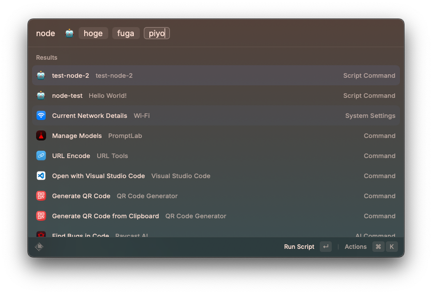
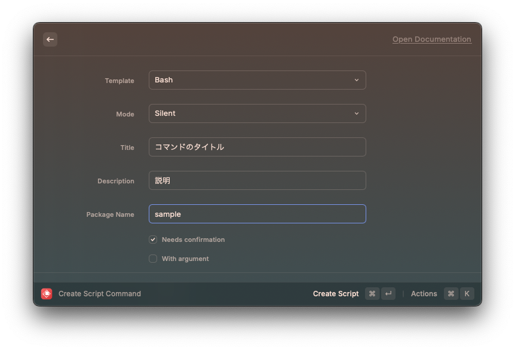
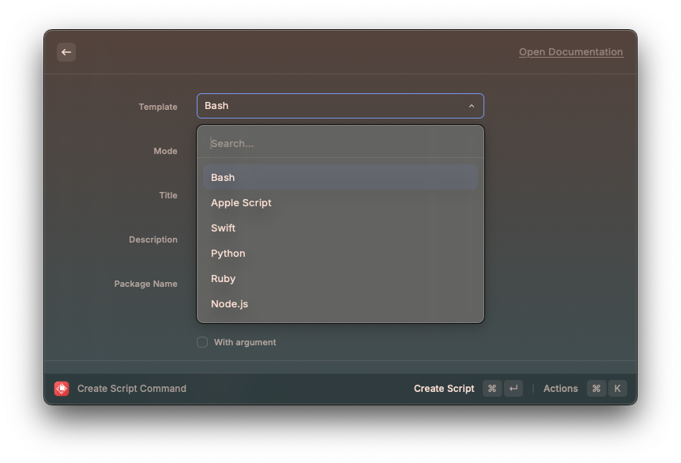
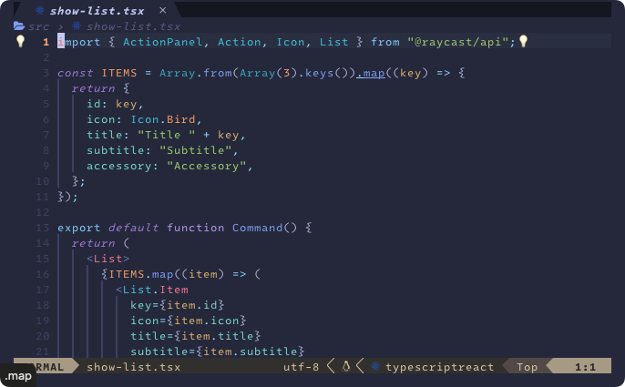
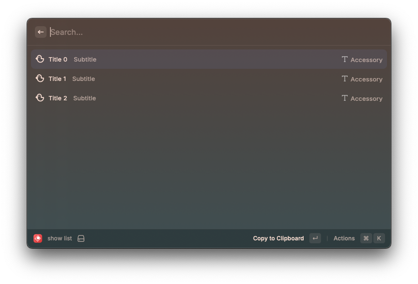
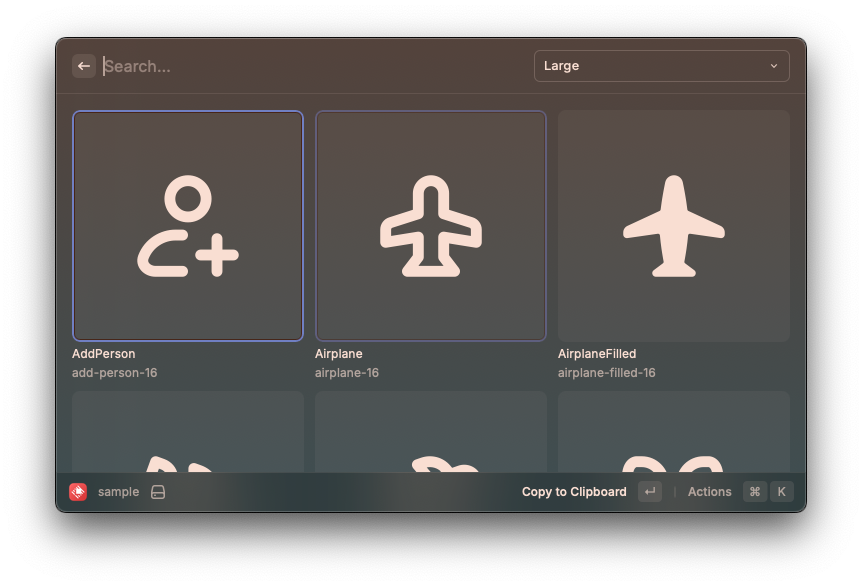
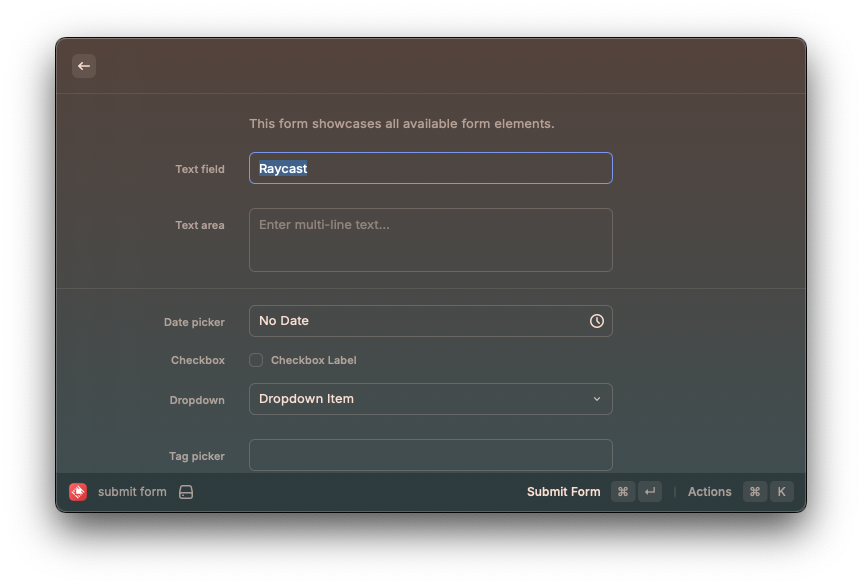
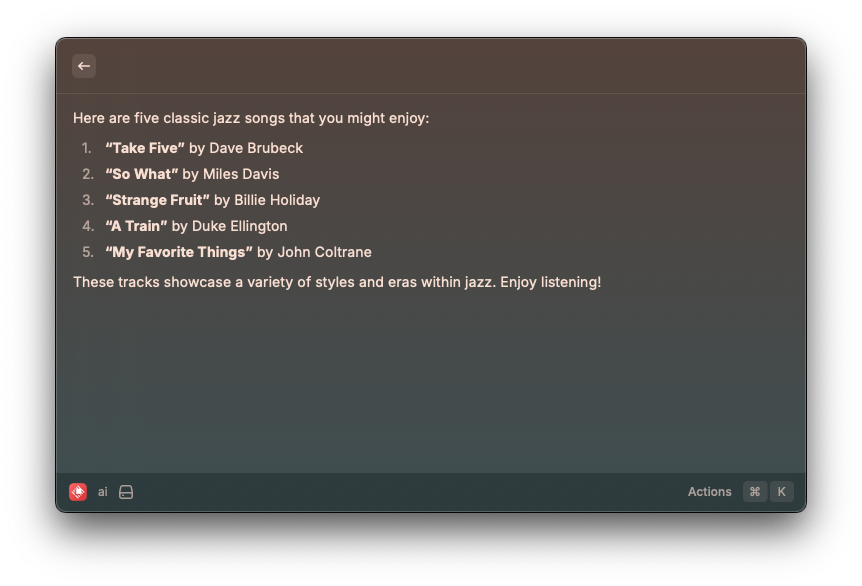
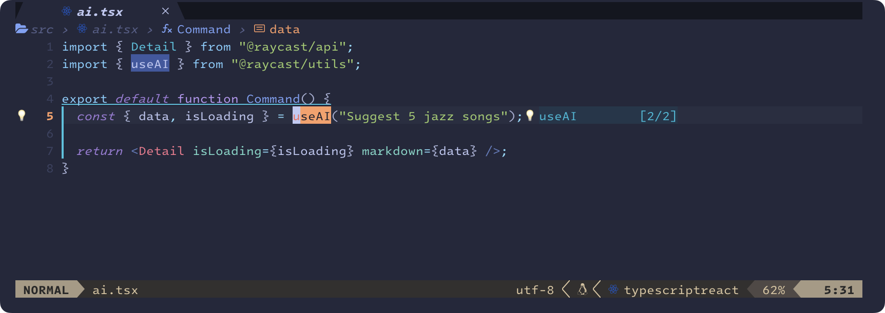

<script src="https://cdn.tailwindcss.com/3.4.4"></script>
<script>tailwind.config = { corePlugins: { preflight: false } }</script>

<!-- _class: slide-title -->

<div class="title">
  <div>Raycastを育てよう！</div>
</div>
<div class="name">Seiji Nakayama</div>
<div class="date-and-event">2025/02/21 Raycast Meetup Japan #1 </div>

---


<style scoped>
.item {
  display: flex;
  align-items: center;
  gap: 0.75em;
}
</style>

<div>
  <h1 class="text-foreground">
    せーじ
    <small class="text-3xl font-bold">(Seiji Nakayama)</small>
  </h1>
  <h5 class="text-dimmed">ただのVimmer</h5>
  <div class="mt-12 space-y-2 text-2xl">
    <div class="item">
      <div class="label">業務</div>
      <span><small>バックエンド・Webの開発（たまにアプリ）</small></span>
    </div>
    <div class="item">
      <div class="label">言語</div>
      <span><small>業務 => Go, TypeScript, Kotlin, Flutter<br /> 趣味=> Haskell, Rust, Lua</small></span>
    </div>
    <div class="item">
      <div class="label">エディタ</div>
      <span>Neovim(intellijも使う)</span>
    </div>
    <div class="item">
      <div class="label">好き</div>
      <span>
        Vim・ロードバイク・車<br />
        <strong>シンプルで拡張性があるプロダクト</strong>
      </span>
    </div>
    <div class="item">
      <div class="label">特徴</div>
      <span>実家が洋菓子店</span>
    </div>
    <div class="item">
      <div class="label">デバイス</div>
      <span><small>Apple / EIZO / HHKB Studio</small></span>
    </div>
    <div class="item">
      <div class="label">サイト</div>
      <a href="https://sijis.me"><small>HomePage</small></a>
      <a href="https://www.raycast.com/n_seiji"><small>Raycast</small></a>
      <a href="https://github.com/n-seiji"><small>GitHub</small></a>
      <a href="https://x.com/se_eiji">
        X
      </a>
    </div>
  </div>
</div>

---

<!-- _class: chapter-divider -->

<div class="left">

### 今回話すこと

</div>

<div class="right">

1. Raycast 便利
2. Script Command のススメ
3. Raycast Extension のススメ
4. 終わりに

</div>

---

<!-- _class: chapter-divider -->

<div class="left">

### Agenda

</div>

<div class="right">

1. **Raycast 便利**
2. Script Command のススメ
3. Raycast Extension のススメ
4. 終わりに

</div>

---

<!-- _class: full lead narration-white -->

Raycast ってすごく便利ですよね！
すごく！

---

## Raycast の標準機能(私がよく使う者たち)

| 機能名            | ユースケース                                              |
| ----------------- | --------------------------------------------------------- |
| AI Chat           | DeepSeek など 20 種類の AI と Chat できる                 |
| AI Command        | カーソルで選択など、様々な形で input を渡せる             |
| Focus             | 作業に集中したいとき、任意のアプリからの通知を止められる  |
| Prompt Lab        | 誰かが公開してる Prompt を拝借できる                      |
| Calendar          | 予定を確認したり、meet にコマンド一つで入れたり           |
| Script Command    | 後ほど紹介                                                |
| Clipboard History | コピーしたものを検索できる。課金すると History が消えない |
| Window Management | window サイズを自在に変化させられる                       |
| Manage Auto Quits | 後ほど紹介                                                |

---

## 余談：Manage Auto Quits はイイぞ〜

inactive になってから設定した時間経つとアプリが勝手に止まる。

たま〜にしか利用しないアプリとか、気付かないうちに勝手に起動してるアプリとか、

pc が重くなるまえに勝手に止めてくれる。便利。

---

<!-- _class: full lead narration-white -->

Raycast はだいたい標準機能が充実してる。

---

<!-- _class: full lead narration-white -->

ただ、たま〜に標準では補えないものもある

# しかし、

---

## だいたい、Raycast の[Store](https://www.raycast.com/store)にある　

- [GitHub](https://www.raycast.com/raycast/github)
- [Docker](https://www.raycast.com/priithaamer/docker)
- [Multipass](https://www.raycast.com/davibe/multipass)
- [Word Count](https://www.raycast.com/itsmingjie/word-count)
- [Color Picker](https://www.raycast.com/thomas/color-picker)
- [JWT Decoder](https://www.raycast.com/gdsmith/jwt-decoder)
- [URL Encode/Decode](https://www.raycast.com/huzef44/url-tools)
- [Browser Bookmarks](https://www.raycast.com/raycast/browser-bookmarks)

---

<!-- _class: full lead narration-white -->

# 素でもめっちゃ使える

---

<!-- _class: full lead narration-white -->

# 素でもめっちゃ使える

###### Vim と違って

---

<!-- _class: full lead narration-white -->

今に満足してませんか、、、？

---

<!-- _class: full lead narration-white -->

# せっかくなら自分の Raycast を育てよう！

---

<!-- _class: full lead narration-white -->

# せっかくなら自分の Raycast を育てよう！

###### そう、Vim を育てるように...!!

---

<!-- _class: chapter-divider -->

<div class="left">

### Agenda

</div>

<div class="right">

1. ~~Raycast 便利~~
2. **Script Command のススメ**
3. Raycast Extension のススメ
4. 終わりに

</div>

---

## エンジニアあるある

面倒なこと、script で簡略化しがち。

とりあえず面倒だとおもったら shell script でコマンドを作る。

shell script で収まらない場合は go とか bun でコマンドを作る。

---

<!-- _class: full lead narration-white -->

今に満足してませんか、、、？

---

### コマンドを実行するには

1. ターミナルの起動
2. コマンドの入力
3. `<CR>`

# の 3 手が必要

---

# Script Command なら 1 手

1. ショートカットを呼ぶ

###### ※引数がないものに限る

---

## もちろん、引数を渡すことも可能

<div class='mt-8 text-3xl'>
  引数の数も設定に応じて増やせる
</div>

<div class="flex justify-center items-center">
  
</div>

---

## Script Command を作る

<div class='mt-8 text-3xl'>
  Raycast で <strong>Create Script Command</strong> を実行し、<br />
  必要な部分を埋めるだけ
</div>

<div class="flex justify-center items-center">
  
</div>

---

## Script Command を編集する

作成されるのは普通の shell script なので、あとは編集するだけ。
Script Command かはファイル冒頭の comment で認識してるっぽい。

```bash
#!/bin/bash

# Required parameters:
# @raycast.schemaVersion 1
# @raycast.title コマンドのタイトル
# @raycast.mode silent
# Optional parameters:
# @raycast.icon 🤖
# @raycast.argument1 { "type": "text", "placeholder": "text only" }
# @raycast.packageName test
# Documentation:
# @raycast.description 説明
# @raycast.author n_seiji
# @raycast.authorURL https://raycast.com/n_seiji
echo "Hello World!"
```

---

## Script Command を編集する

引数は @raycast.argument1 を 2, 3 と増やすと増えていく。
詳しい仕様はこちら => [GitHub](https://github.com/raycast/script-commands)

```bash
#!/bin/bash

# Required parameters:
# @raycast.schemaVersion 1
# @raycast.title コマンドのタイトル
# @raycast.mode silent
# Optional parameters:
# @raycast.icon 🤖
# @raycast.argument1 { "type": "text", "placeholder": "text only" } <= ココ
# @raycast.packageName test
# Documentation:
# @raycast.description 説明
# @raycast.author n_seiji
# @raycast.authorURL https://raycast.com/n_seiji
echo "Hello World!"
```

---

## Script Command で使える言語

<div class='mt-8 text-3xl'>
色々ある。ここにない言語もできるか？とチャレンジしたがどう頑張ってもランタイムがないのか動かない。

sh で実行する形にしておけば動くので、Go とかをコンパイルしたものなら動く。

</div>

<div class="flex justify-center items-center">
  
</div>

---

<!-- _class: chapter-divider -->

<div class="left">

### Agenda

</div>

<div class="right">

1. ~~Raycast 便利~~
2. ~~Script Command のススメ~~
3. **Raycast Extension のススメ**
4. 終わりに

## </div>

---

<!-- _class: full lead narration-white -->

### まだまだ満足できない！そんなあなたには

# Raycast Extension

---

## Raycast Extension の使い所　

Script Command でだいたいできるが、

<u>**ちょっとリッチな見た目にしたい**</u>場合に選択肢に入ってくる。

とくに、**<u>複数から選択させる UI</u>** や **<u>Form のように情報を複数入力する UI</u>** が必要な場合とか

---

## Raycast Extension の使い所　

Script Command でだいたいできるが、

ちょっとリッチな見た目にしたい場合に選択肢に入ってくる。

とくに、複数から選択させる UI や Form のように情報を複数入力する UI が必要な場合とか

動くものを作るのに <u>**1 分**</u> かからないので遊びでとりあえず試すのがおすすめ。

---

## Raycast Extension の使い所　

Script Command でだいたいできるが、

ちょっとリッチな見た目にしたい場合に選択肢に入ってくる。

とくに、複数から選択させる UI や Form のように情報を複数入力する UI が必要な場合とか

動くものを作るのに 1 分かからないので遊びでとりあえず試すのがおすすめ。

## +　 AI もめちゃくちゃ簡単に使える!

---

## Raycast Extension の作成方法　

Raycast で「Create Extension」と検索し、必要な箇所を埋めてく(以下略)

基本上記の説明だけでできるはず(本当に簡単)だが、

必要があれば公式のチュートリアル参照 => [Create Your First Extension](https://developers.raycast.com/basics/create-your-first-extension)

---

## 作成されたコード

<div class='mt-8 text-3xl'>
  中はReact。UIを作るには @raycast/api のコンポーネントを使う必要があり、自前ではUIは作れない。

逆に UI を作る必要がないので簡単。

</div>

<div class="flex justify-center items-center mt-10">
  
</div>

---

## Raycast Extension のテンプレの種類が豊富　

<div class='mt-8 text-3xl'>
  基本的なList表示、Grid表示やAIとの会話のIFのテンプレなど10種類ある
</div>

<div class="flex flex-col gap-10 justify-center items-center mt-10 rounded-xl overflow-hidden">
  <div class="flex gap-10 justify-center items-center">
    
    
  </div>
  <div class="flex gap-10 justify-center items-center">
    
    
  </div>
</div>

---

## Raycast Extension のテンプレの種類が豊富　

<div class='mt-8 text-3xl'>
  <p>AIはこんな感じで使える。optionを指定することで、</p>
  <p>Model(なぜか20種類ぐらいある)や</p>
  <p>Creativity(創造性='height', 'medium', etc..)を指定できる </p>
</div>

<div class="flex justify-center items-center mt-10">
  
</div>

---

<!-- _class: chapter-divider -->

<div class="left">

### Agenda

</div>

<div class="right">

1. ~~Raycast 便利~~
2. ~~Script Command のススメ~~
3. ~~Raycast Extension の~~
4. **終わりに**

</div>

---

## 個人的には Raycast を盛り上げたい!

Raycast はめちゃめちゃ便利だし、遊ぶと無限に楽しい。

特にハックするのたのしい => [Raycast の AI を Raycast 以外から利用する
](https://qiita.com/se_eiji/items/00c8448594f094231763)

みなさんも面白いことしたら発信していただけると。。。！
